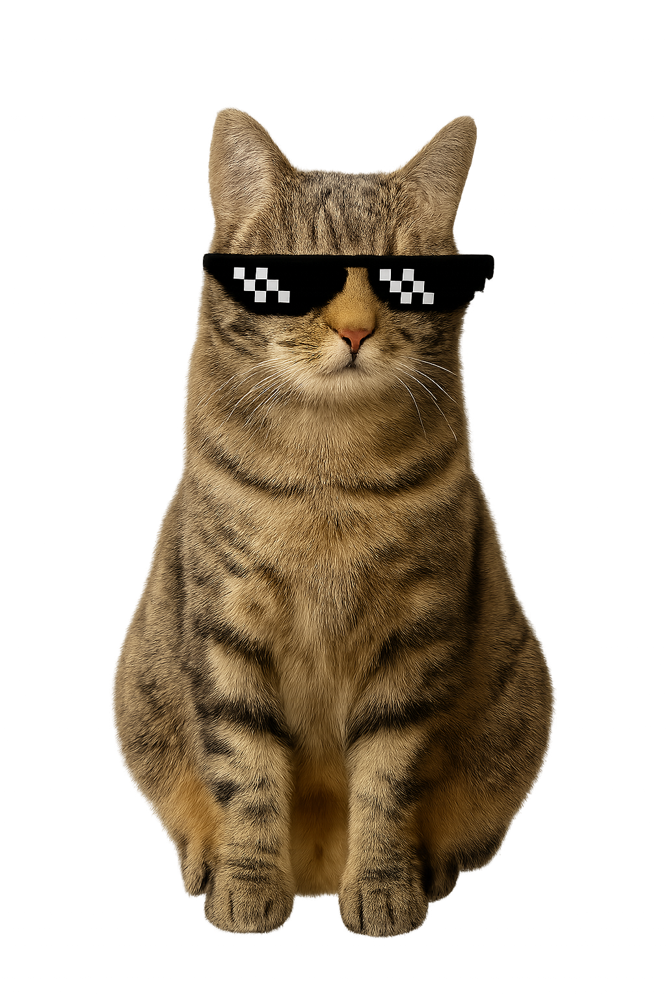

### **tabby** is a simple self-hosted tablature manager for musicians.

## FEATURES

- Organize tabs by instrument, artist, and song

- Automatic chord highlighting and transposition (+1 / -1 semitone)

- Chord diagrams directly in the tab view

- Dynamically generated chord reference page

- Lightweight Flask web app, Docker-compatible

## ROADMAP

**tabby** is very much a work in progress. My initial goal was to build a basic app that's easy to host and allows me to stop relying on ad-heavy tablature sites. 

Now that that's been achieved, here are some things I'd love to add in the near future:

- **Support for `.tef` and `.pdf`**
- **Setlists/playlists** 
- **Chord diagrams for instruments other than guitar**
- **Auto-import favorites from external sources (e.g., Ultimate Guitar)** 
- **Better (or any) styling**
- **Automatic handling + organization of file names, type, etc.**
  
## GETTING STARTED

You can run **tabby** locally or via docker. First things first, clone the repository:

```
git clone git@github.com:5h4y/tabby.git 
cd tabby
```

### Docker

```
docker compose up -d
```

If you're using Docker, the default port is `5151`.

### Local

```
python3 -m venv venv
source venv/bin/activate
pip install -r requirements.txt
python app/app.py
```

If you're running locally without Docker, the default port is `5001`.


### Tab & Chord Organization

Place tabs in tabs/<instrument>/<artist>/ directories. Example:

`tabs/guitar/Vince Guaraldi/Ginza Samba.txt`

Chord diagram SVGs live in `static/chords/`. You can auto-generate these via the included script and `chords.csv`.
